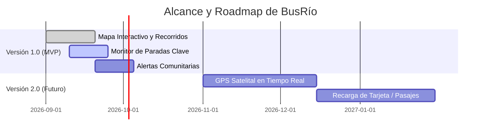

# 🚌 Documento de Investigación y Propuesta de Proyecto: "BusRío"
**Evaluación Final Integradora (E.F.I.) - Movilidad y Transporte Urbano**  
**Ciudad de Río Cuarto, Córdoba, Argentina**

---

## 1. 📌 Resumen de la Idea

### Contexto y Problemática Local
En la ciudad de Río Cuarto, las paradas de transporte público con alta afluencia de pasajeros —tales como **Plaza Roca (Centro)**, el **Hospital San Antonio de Padua**, la **Universidad Nacional de Río Cuarto (UNRC)** y los nodos principales de **Banda Norte** y **Barrio Alberdi**— presentan constantes complicaciones operativas. Los usuarios sufren demoras severas, falta de previsibilidad en las frecuencias, cambios repentinos de recorridos sin previo aviso por obras o manifestaciones, y escasa información durante horarios pico o fines de semana.

### Solución Propuesta: "BusRío"
**BusRío** es un monitor interactivo y progresivo (PWA - Progressive Web App) diseñado para la ciudadanía de Río Cuarto. Permite consultar en tiempo real y desde cualquier dispositivo:
* Recorridos interactivos de las líneas urbanas sobre mapa vectorizado.
* Tiempos estimados de arribo a paradas clave.
* Sistema de **Alertas Comunitarias** donde los propios pasajeros reportan cortes, unidades colmadas o desvíos imprevistos.
* Tablero accesible con soporte para personas con movilidad reducida y optimización de consumo de datos móviles (Low-Data Mode).

---

## 2. 🏢 Datos de la Empresa

### Datos Principales
* **Nombre Comercial / Razón Social**: `BusRío Tech S.A.S.` (Tecnologías de Movilidad Río Cuarto S.A.S.)
* **Domicilio Físico**: Calle Constitución 645, Piso 3, Oficina 302, X5800 Río Cuarto, Córdoba, Argentina.
* **Teléfono de Contacto**: +54 (0358) 465-9800
* **Correo Electrónico Oficial**: `contacto@busrio.com.ar` / `soporte@busrio.com.ar`
* **CUIT**: 30-71829450-4
* **Sitio Web Oficial**: `https://www.busrio.com.ar`

### ¿A qué se dedica la empresa?
`BusRío Tech S.A.S.` es una empresa de base tecnológica especializada en **Sistemas Inteligentes de Transporte (ITS)**, desarrollo de software urbano y soluciones de experiencia ciudadana. Diseñamos herramientas digitales orientadas a ciudades intermedias del interior argentino, mejorando la interacción entre los ciudadanos, el transporte público y las decisiones de infraestructura urbana.

### ¿Ya tiene un sitio o aplicación?
Actualmente, la empresa cuenta con una versión alfa interna y el prototipo funcional listo para su lanzamiento MVP (Minimum Viable Product) en formato **PWA (Progressive Web App)**, optimizada tanto para ejecutarse directamente en navegadores web de smartphones y computadoras, como para ser instalable como app nativa sin necesidad de descarga desde tiendas de aplicaciones pesadas.

---

### 🎨 Identidad Visual y Formatos de Logo

#### Icono para Apps y Tiendas (Favicon / App Icon)
* **Concepto Visual**: Un isotipo de silueta geométrica con bordes suavemente redondeados (Squircle) en gradiente azul marino y verde sustentable. Integra la letra estilizada **"R"** de Río Cuarto convergiendo con la parte frontal de un colectivo urbano y ondas concéntricas de señalización GPS.
* **Dimensiones y Especificaciones**:
  * `iOS / Android App Icon`: 512x512 px (PNG 32-bit sin transparencia para tienda).
  * `Favicon Web`: Multi-resolución (16x16, 32x32, 192x192, 512x512 px en `.png` y `.svg`).

#### Logo en Diferentes Formatos
1. **Isotipo (Icono de Marca)**: Formato `.SVG` vectorial escalable para aplicaciones móviles, favicon y encabezados reducidos.
2. **Logotipo (Texto de Marca)**: Tipografía personalizada en fuente `Poppins Black`, combinando azul cobalto (`#1e3a8a`) y verde esmeralda (`#10b981`).
3. **Isologotipo / Imagotipo Completo**: Isotipo a la izquierda con el texto "BusRío - Monitor Urbano" a la derecha, para encabezados web y pie de página.
4. **Variantes Tecnológicas Exportadas**:
   * `SVG Vectorial`: Máxima nitidez y cero pérdida de calidad responsive.
   * `PNG Fondo Transparente`: Para sobreposición en mapas y banners (Alta Res 300 DPI).
   * `Versión Dark Mode`: Optimizado con texto blanco puro (`.force-text-white`) y acentos de luz neón sobre fondo oscuro slate-900 (`#0f172a`).

---

## 3. ⚙️ Requerimientos de Software (Frontend) & Justificación Técnica

### 1. Framework / Herramienta CSS: **Tailwind CSS (v3 / v4)**
* **Justificación Técnica**:
  * **Velocidad de Carga y Tamaño de Bundle Mínimo**: Gracias a su compilación JIT (Just-In-Time), Tailwind extrae únicamente las clases utilizadas, generando un archivo CSS final de menos de 10 KB gzippeado.
  * **Estrategia Mobile-First Nativa**: Permite adaptar tableros y mapas complejos a pantallas móviles pequeñas de manera ultra intuitiva con prefijos responsive (`sm:`, `md:`, `lg:`).
  * **Soporte Nativo de Dark Mode**: Implementación directa por clase CSS (`dark:`), ideal para usuarios que esperan colectivos de noche o en paradas con baja iluminación.

### 2. Librería de Mapeo Interactiva: **Leaflet.js + OpenStreetMap**
* **Justificación Técnica**:
  * Cero costo por licencias API (a diferencia de Google Maps API que cobra por render de mapa).
  * Carga asíncrona ligera (peso menor a 40 KB) sin bloquear el hilo principal de ejecución.
  * Permite personalizar marcadores de paradas (Plaza Roca, Hospital, UNRC) y trazar polígonos de recorridos con colores distintivos por línea.

### 3. Hosting Propuesto y Costos

| Proveedor | Plan Recomendado | Características | Costo Estimado |
| :--- | :--- | :--- | :--- |
| **Vercel / Netlify** *(Principal)* | Hobby / Starter | Despliegue continuo desde GitHub, CDN global, HTTPS automático y soporte nativo PWA. | **\$0 USD / mes** (Gratuito para MVP) |
| **Cloudflare Pages** *(Backup)* | Free Tier | Protección DDoS ilimitada y distribución ultra rápida Edge. | **\$0 USD / mes** |
| *Escala Futura (Producción)* | Pro Plan | Ancho de banda ilimitado y métricas analíticas dedicadas. | \$20 USD / mes (aprox. \$25.000 ARS) |

### 4. Dominio Web y Costo (NIC Argentina)
* **Dominio Elegido**: `busrio.com.ar` (y reserva de `busrio.ar`).
* **Entidad Registrante**: NIC Argentina (`nic.ar`).
* **Costo de Registro y Renovación Anual**: **\$8.500 ARS a \$12.000 ARS / año** (Tarifa oficial NIC.ar para dominios `.com.ar`).

---

## 4. 📲 Social Media & Canales Corporativos

1. **Correo Corporativo (Google Workspace / Gmail)**:
   * `busrio.riocuarto@gmail.com` / `contacto@busrio.com.ar`
2. **Facebook Empresarial**:
   * `https://facebook.com/BusRioOficial` (Página verificada para difusión masiva a usuarios de mediana y mayor edad en Río Cuarto).
3. **Instagram Empresarial**:
   * `@busrio.rc` (`https://instagram.com/busrio.rc`) (Infografías de desvíos, novedades de frecuencias para estudiantes universitarios).
4. **Canal de YouTube**:
   * `https://youtube.com/@BusRioOficial` (Video-tutoriales de uso de la PWA, explicativos de combinaciones de líneas y trasbordos).
5. **Google Form / Feedback Integrado**:
   * Formulario embebido en la aplicación para recibir reportes de paradas dañadas, sugerencias de horarios y fallas de frecuencias.

---

## 5. 💎 Valor Agregado de la Propuesta

¿Qué tiene **BusRío** que el cliente o ciudadano **NO** encuentra en opciones gratuitas estándar como Google Maps o Moovit?

1. **Alertas Comunitarias en Tiempo Real ("Waze del Colectivo")**:
   * Ni Google Maps ni las apps tradicionales reportan los cortes de calle o protestas inmediatas en la zona céntrica de Río Cuarto. BusRío permite a los propios usuarios validar o alertar sobre desvíos en vivo.
2. **Optimización de Consumo de Datos (Low-Data Mode)**:
   * Funciona fluidamente incluso con conexiones 3G débiles cerca del río o en zonas periféricas, consumiendo hasta un 80% menos datos móviles que Google Maps.
3. **Matriz de Trasbordos y Boleto Combinado Local**:
   * Calculador adaptado a la reglamentación local de Río Cuarto (ventana de tiempo para trasbordo gratuito o bonificado entre líneas urbanas).
4. **Modo Monitor de Parada para Pantallas Físicas**:
   * Permite ser proyectado en salas de espera (ej. Hospital San Antonio de Padua, locales comerciales frente a Plaza Roca), convirtiendo cualquier televisor o tablet en una pantalla informativa en vivo.
5. **Filtro Estricto de Accesibilidad**:
   * Permite visibilizar unidades que cuentan con rampa para sillas de ruedas o piso bajo adaptado.

---

## 6. 🎯 Alcance del Proyecto

### ✅ Incluido en la Primera Versión (V1 - MVP)
* **Mapa Interactivo**: Trazado visual de recorridos de las líneas de transporte urbano de Río Cuarto.
* **Monitor de Paradas Críticas**: Tiempos teóricos y calculados de arribo en paradas clave (Plaza Roca, Hospital, UNRC, Centro de Trasbordo).
* **Módulo de Alertas Ciudadanas**: Reportes de cortes, demoras extremas y cambios de recorrido.
* **Buscador Inteligente**: Filtrado por número de línea, origen y destino.
* **Soporte PWA Instalable**: Funcionamiento multiplataforma (Android, iOS, PC).
* **Modo Oscuro / Claro**: Selección automática y manual adaptada al entorno.

### ❌ NO Incluido en la V1 (Reservado para Versión 2.0 / Futuras Iteraciones)
* Telemetría GPS en tiempo real de cada colectivo individual (requiere convenio e integración de API hardware con la empresa concesionaria de transporte).
* Venta o recarga de pasajes / saldo de tarjeta de transporte.
* Cobertura de colectivos interurbanos (ej. Río Cuarto - Holmberg - Las Higueras).
* Módulo de reserva de asientos o viajes a demanda.

---

## 7. 📋 Detalle de Contenidos y Características

1. **Módulo Mapa & Recorridos**:
   * Selector dinámico por Línea (ej. Linea 1, Linea 2, Linea 8, etc.).
   * Visualización de capas (GeoJSON) con los trayectos de ida y vuelta.
2. **Módulo Monitor de Parada**:
   * Tarjetas informativas con cuenta regresiva estimada de llegada por línea.
   * Indicador visual de estado de tráfico: `Verde (Normal)`, `Amarillo (Frecuencia reducida)`, `Rojo (Demora severa/Desvío)`.
3. **Módulo de Reporte Ciudadano (Feedback Form)**:
   * Botón de acción rápida en 1-clic para reportar "Parada con mucha gente", "Colectivo desviado", "Unidad no pasó".
4. **Módulo de Guía de Trasbordo**:
   * Sugerencia de combinaciones de líneas para traslados desde barrios alejados (Alberdi, Banda Norte) hacia el Hospital o la UNRC.
5. **Sección Institucional & Equipo**:
   * Presentación de la empresa `BusRío Tech S.A.S.`, visión de impacto local y formulario de contacto.

---

## 8. 💰 Modelo de Monetización

Para garantizar la sustentabilidad financiera sin cobrarle suscripción al usuario común, se proponen 3 vías de ingresos:

1. **Publicidad Geolocalizada B2B (Comercios Locales)**:
   * Comercios ubicados a menos de 200 metros de paradas concurridas (ej. librerías cerca de la UNRC, farmacias cerca del Hospital, locales gastronómicos en Plaza Roca) pueden publicar promociones geolocalizadas no invasivas dentro del mapa de la app.
2. **Servicios de Analítica Urbana B2G (Business to Government / Municipalidad)**:
   * Comercialización de reportes anonimizados de demanda de transporte, cuellos de botella de tiempo de espera y zonas con mayor cantidad de alertas comunitarias para ser utilizados por la Secretaría de Transporte o el Municipio en la toma de decisiones de infraestructura.
3. **Red de Paradas Amigables (Sponsorship Corporativo)**:
   * Alianzas con sanatorios privados, universidades y centros comerciales que deseen integrar el widget de "BusRío" en sus pantallas institucionales o patrocinar la app.

---

## 9. 👥 Equipo de Trabajo

A los clientes e instituciones les genera confianza ver a las personas detrás del proyecto. El equipo fundador de **BusRío** está compuesto por:

 

| Miembro | Cargo | Foto / Avatar | Descripción Profesional |
| :--- | :--- | :--- | :--- |
| **Lucas Molina** | Co-Founder & Lead Frontend / UI-UX Engineer |  | Estudiante avanzado de desarrollo de software con amplia experiencia en arquitectura Frontend, TailwindCSS y diseño de sistemas interactivos. Responsable de la experiencia visual, usabilidad móvil y mapa interactivo. |
| **Tadeo** | Co-Founder & Head of Product / Backend Developer |  | Especialista en lógica de negocios, estructuración de datos de transporte urbano, APIs y estrategias de monetización B2B/B2G. Lidera el procesamiento de horarios, paradas y modelo de datos. |

---

### 📌 Conclusión y Próximos Pasos
Este documento establece las bases operativas, técnicas y estratégicas para el desarrollo y despliegue del proyecto **BusRío** en la ciudad de Río Cuarto. Con una base sólida en TailwindCSS, un mapa liviano sobre Leaflet, y un enfoque colaborativo único, BusRío resuelve de forma directa una necesidad crítica de movilidad urbana local.
