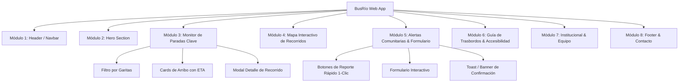

# Arquitectura del Sistema - BusRío

## 1. Stack Técnico Frontend
El desarrollo del proyecto **BusRío** se estructura como una Single Page Application (SPA) / Progressive Web App (PWA) de Frontend puro, optimizada para rendimiento y adaptabilidad:

- **Estructura Base**: HTML5 semántico moderno con soporte de metadatos de accesibilidad (ARIA) y viewport responsive.
- **Framework de Estilos**: **TailwindCSS (v3 vía CDN)** con configuración extendida para soporte nativo de Modo Oscuro (`dark:`), paleta corporativa y tipografía.
- **Tipografía**: Google Fonts CDN (`Poppins` para títulos, marcas y números de línea; `Inter` para cuerpos de texto y tablas de frecuencias).
- **Lógica e Interactividad**: Vanilla JavaScript moderno (ES6+), organizado de forma modular, libre de dependencias pesadas.
- **Mapeo y Georreferenciación**: **Leaflet.js + OpenStreetMap (OSM)**, librería de mapas liviana (< 40 KB) sin requerimiento de API Keys comerciales ni costos por renderizado.
- **Persistencia de Preferencias**: API `localStorage` del navegador para almacenar el estado del tema (Claro / Oscuro) y paradas favoritas.

---

## 2. Mapa de Módulos y Componentes
La aplicación se divide en 8 módulos cohesivos ordenados jerárquicamente:

### Detalle Funcional por Módulo:
1. **Header / Navbar**:
   - Logotipo vectorizado (`BusRío` con isotipo de colectivo + onda GPS).
   - Enlaces de salto suave (Scroll Spy) a secciones: *Monitor*, *Mapa*, *Alertas*, *Trasbordos*, *Equipo*.
   - Botón interactivo de alternancia de tema (Modo Claro / Modo Oscuro).
   - Menú responsive tipo "hamburguesa" colapsable para dispositivos móviles.
2. **Hero Section**:
   - Título principal de propuesta de valor (*"Tu colectivo en tiempo real en Río Cuarto"*).
   - Buscador predictivo por número de línea o garita (Plaza Roca, Hospital, UNRC, etc.).
   - Acceso directo a la acción principal: botón *"Ver Mapa en Vivo"*.
3. **Monitor Interactivo de Paradas Clave**:
   - Selector de nodos críticos de la ciudad (Plaza Roca, Hospital San Antonio de Padua, UNRC, Centro de Trasbordo, Banda Norte, Alberdi).
   - Grilla interactiva de tarjetas con cuenta regresiva de llegada (ETA), estado de tráfico (`Normal`, `Frecuencia Reducida`, `Demora/Desvío`) e icono de accesibilidad (rampa).
   - Modal emergente interactivo con el recorrido detallado de la línea seleccionada.
4. **Mapa Interactivo de Recorridos**:
   - Contenedor con Leaflet.js centrado en Río Cuarto (`-33.123, -64.349`).
   - Trazado de recorridos en capas coloreadas según la línea (Roja, Verde, Azul, etc.).
   - Marcadores personalizados e interactivos en paradas clave con popups informativos.
5. **Módulo de Alertas Comunitarias & Formulario de Reporte**:
   - Botonera de reporte rápido en 1-clic (*"Colectivo lleno"*, *"Demora de +15m"*, *"Corte de calle"*).
   - Formulario estructurado para reportar incidencias con campos de validación visual y confirmación interactiva mediante toast/modal de éxito.
6. **Guía de Trasbordos & Accesibilidad**:
   - Tarjetas explicativas del sistema de boleto combinado local en Río Cuarto.
   - Filtro visual para identificar coches adaptados para movilidad reducida.
7. **Institucional & Equipo Fundador**:
   - Ficha corporativa de `BusRío Tech S.A.S.`
   - Perfiles profesionales de Lucas Molina (Lead Frontend / UI-UX) y Tadeo (Head of Product / Logic).
8. **Footer & Contacto**:
   - Enlaces rápidos, dirección física en Río Cuarto (Constitución 645), soporte técnico (`contacto@busrio.com.ar`) y redes sociales (`@busrio.rc`).

---

## 3. Modelo de Datos Mock (Frontend Data Store)
Para dar cumplimiento a la consigna sin requerir servidores externos, los datos se estructuran en objetos JSON dentro de JavaScript:
- `linesData`: Colección de líneas urbanas de Río Cuarto (Línea 1, 2, 5, 8, 11, 14), con color de línea, cabeceras, paradas y coordenadas de trazado.
- `stopsData`: Lista de paradas críticas georreferenciadas con líneas que confluyen en ellas.
- `alertsData`: Registro inicial de alertas ciudadanas activas en la ciudad.

---

## 4. Tecnologías Prohibidas (Límites Estrictos del Alcance)
En cumplimiento estricto con los requerimientos académicos de la EFI:
- ❌ **NO backend de servidor**: Prohibido el uso de Node.js, Express, Python/Django, PHP o Ruby.
- ❌ **NO bases de datos externas**: Prohibido MySQL, PostgreSQL, MongoDB o Firebase. La persistencia de sesión es local (`localStorage`).
- ❌ **NO frameworks SPA complejos**: No usar React, Angular ni Vue para este entregable específico; mantener HTML5 semántico puro y JavaScript modular.
- ❌ **NO estilos inline desordenados**: Prohibido el uso de atributos `style="..."` dispersos; toda la maquetación debe realizarse con utilidades TailwindCSS.
- ❌ **NO APIs de pago**: Prohibido el uso de Google Maps JavaScript API con facturación obligatoria.
