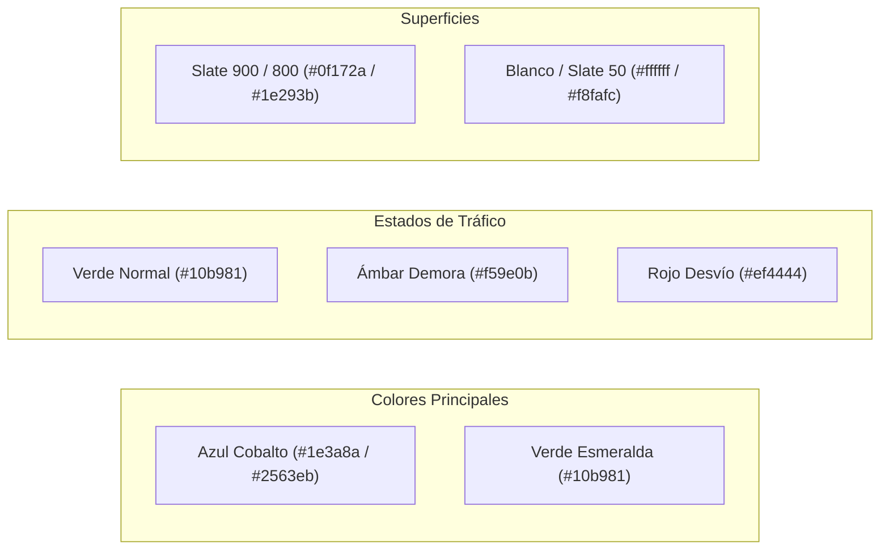

# Convenciones de Diseño y Código - BusRío

## 1. Semántica HTML5 y Buenas Prácticas
Para asegurar accesibilidad, SEO local y código limpio, se aplican las siguientes reglas semánticas:

* **Estructura jerárquica**:
  * `<header>`: Exclusivo para la cabecera principal y barra de navegación superior.
  * `<nav>`: Contenedor estricto de listas de enlaces interactivos.
  * `<main>`: Contenedor único del contenido central de la vista.
  * `<section>`: Delimitador de cada uno de los módulos funcionales, siempre acompañado de un encabezado (`<h2>` o `<h3>`).
  * `<article>`: Tarjetas individuales del monitor de paradas y reportes de alertas ciudadanas.
  * `<footer>`: Pie de página con créditos, enlaces legales y contacto.
* **Interactividad y Accesibilidad**:
  * Elementos accionables deben ser obligatoriamente etiquetas `<button type="button">`, nunca `
` ni `` con manejadores de clic huérfanos.
  * Todas las imágenes y logotipos deben incluir atributo `alt` descriptivo (ej. `alt="Logotipo oficial de BusRío"`).
  * Los botones que únicamente contienen iconos (como el alternador de tema o el menú móvil) deben incluir `aria-label="Alternar modo oscuro"` o texto oculto con `sr-only`.

---

## 2. Paleta de Colores Institucional (Tailwind CSS)
La paleta está calibrada para transmitir seguridad de transporte público y sustentabilidad ecológica, con soporte bimodal completo:

### Clases Tailwind Correspondientes:
* **Identidad Primaria**:
  * Fondo primario: `bg-blue-900` (`#1e3a8a`), `bg-blue-600` (`#2563eb`), hover: `hover:bg-blue-700`.
  * Texto primario de marca: `text-blue-600 dark:text-blue-400`.
* **Identidad Secundaria (Sustentable / Éxito)**:
  * Fondo secundario: `bg-emerald-500` (`#10b981`), `bg-emerald-600` (`#059669`).
  * Badges de servicio normal: `bg-emerald-500/10 text-emerald-600 dark:text-emerald-400 border-emerald-500/20`.
* **Alertas y Tráfico**:
  * Demoras / Frecuencia reducida: `bg-amber-500/10 text-amber-600 dark:text-amber-400 border-amber-500/20`.
  * Cortes / Desvíos / Cancelación: `bg-rose-500/10 text-rose-600 dark:text-rose-400 border-rose-500/20`.
* **Modo Oscuro (Predeterminado)**:
  * Fondo general: `bg-slate-900` (`#0f172a`).
  * Contenedores y Tarjetas: `bg-slate-800/90 border border-slate-700/60`.
  * Texto principal: `text-white` o `text-slate-100`.
  * Texto secundario y leyendas: `text-slate-300` o `text-slate-400`.
* **Modo Claro**:
  * Fondo general: `bg-slate-50` (`#f8fafc`).
  * Contenedores y Tarjetas: `bg-white border border-slate-200 shadow-sm`.
  * Texto principal: `text-slate-900`.
  * Texto secundario: `text-slate-600`.

---

## 3. Tipografía y Jerarquía Visual
Importadas desde Google Fonts en el `<head>` del documento:

* **Títulos y Marca (`font-heading`)**:
  * Fuente: `'Poppins', sans-serif`.
  * Pesos utilizados: `600 (SemiBold)` para subtítulos de tarjetas y badges; `700 (Bold)` y `800 (ExtraBold)` para encabezados de sección y título del Hero.
* **Cuerpo de Texto y Tablas (`font-sans`)**:
  * Fuente: `'Inter', sans-serif`.
  * Pesos utilizados: `400 (Regular)` para descripciones de recorridos; `500 (Medium)` para etiquetas de formularios y listas de horarios.
  * Interlineado amplio (`leading-relaxed`) para optimizar la lectura en pantallas móviles expuestas al sol.

---

## 4. Diseño Responsive y Micro-interacciones
* **Estrategia Mobile-First**:
  * Todas las clases base se definen para pantallas pequeñas (`< 768px`) y se expanden con prefijos (`md:`, `lg:`).
  * En celulares: el monitor se despliega en 1 columna vertical (`grid-cols-1`) con botones de al menos 44px de altura táctil.
  * En pantallas medianas y grandes: `md:grid-cols-2 lg:grid-cols-3` para aprovechar el ancho visual.
* **Micro-interacciones y Efectos Hover**:
  * **Transiciones fluidas**: `transition-all duration-200 ease-in-out` en todos los elementos interactivos.
  * **Elevación de Tarjetas**: `hover:-translate-y-1.5 hover:shadow-xl` para brindar sensación de profundidad.
  * **Botones**: `hover:scale-105 active:scale-95` para proporcionar respuesta táctil inmediata.
  * **Arribo Inminente**: Las tarjetas con colectivos arribando en $\le 5$ minutos integran la clase `animate-pulse` en su indicador de estado.
