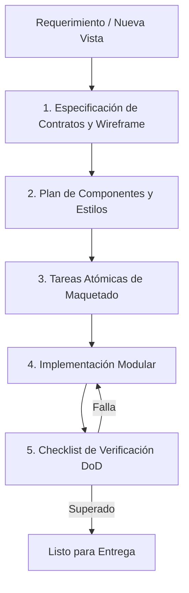

# Flujo de Trabajo y Control de Calidad (SDD) - BusRío

Este documento define la metodología de desarrollo Spec-Driven Development (SDD) basada en el marco Gentle-AI y los criterios estrictos del Definition of Done (DoD).

---

## 1. Ciclo SDD Adaptativo de Maquetado
El proceso de construcción sigue una progresión disciplinada y modular:

### Fases de Implementación en BusRío:
* **Fase 1: Estructura HTML5 Semántica y Accesible**:
  * Maquetar el documento base (`index.html`) con `<header>`, `<nav>`, `<main>`, `<section>`, `<article>`, `<aside>` y `<footer>`.
  * Incorporar metatags de viewport para diseño responsive, fuentes de Google Fonts e iconos.
* **Fase 2: Estilizado con Tailwind CSS (v3)**:
  * Inyectar configuración de paleta institucional (Azul Cobalto, Verde Esmeralda, Slate) y fuentes (`Poppins`, `Inter`).
  * Diseñar la vista Mobile-First e implementar clases para Modo Oscuro (`dark:`) y Modo Claro.
* **Fase 3: Integración de Mapeo Interactivo con Leaflet.js**:
  * Configurar contenedor de mapa centrado en Río Cuarto.
  * Trazar trayectos con coordenadas reales y marcadores en garitas clave.
* **Fase 4: Dinámicas e Interactividad con JavaScript**:
  * Lógica de alternador de tema oscuro/claro con persistencia en `localStorage`.
  * Filtro interactivo de líneas y búsqueda en vivo.
  * Modal emergente de recorridos con apertura y cierre accesible (tecla Escape o clic exterior).
  * Validación reactiva del formulario de alertas ciudadanas y mensaje toast de confirmación.
* **Fase 5: Validación Rigurosa del Definition of Done (DoD)**.

---

## 2. Definition of Done (DoD) - Criterios de Aceptación
Ningún componente, módulo o funcionalidad se da por concluido si no satisface el siguiente checklist:

### 1. Justificación Técnica
* Explicar siempre el **POR QUÉ** antes del **CÓMO** de cada solución maquetada.

### 2. Verificación Visual de los 4 Estados de UI
* ⏳ **Loading (Carga)**: Skeletons o indicadores visuales fluidos mientras se cargan o filtran paradas.
* 📭 **Empty (Vacío)**: Mensaje amigable e ilustrativo cuando un criterio de búsqueda no arroje resultados (ej. *"No se encontraron líneas para esta parada"* con botón para restablecer filtros).
* ❌ **Error (Falla)**: Señalización visual en rojo/ámbar de campos obligatorios faltantes en el formulario de reportes con mensajes claros de ayuda.
* ✅ **Success (Éxito)**: Renderizado armónico de datos reales y confirmación visual inmediata (toast verde) tras enviar un reporte.

### 3. Adaptabilidad Responsive Comprobada
* Verificado en resolución móvil pequeña (375px y 414px) usando DevTools / F12 sin cortes de pantalla.
* Menú hamburguesa completamente operativo en celulares.
* Cero scroll horizontal no deseado.

### 4. Código Limpio y Semántico
* Cero `console.log` o código de depuración residual.
* Cero atributos de estilo en línea (`style="..."`).
* Accesibilidad comprobada: atributos `alt` en imágenes y `aria-label` en controles interactivos.
